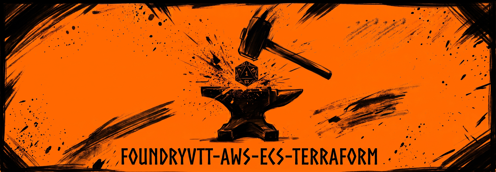
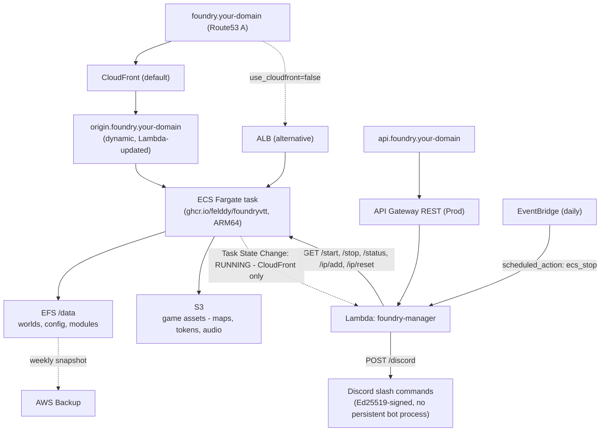

# FoundryVTT on AWS (Terraform)



Terraform infrastructure for running [FoundryVTT](https://foundryvtt.com/) on AWS ECS Fargate. Built for a personal game server running a small group - cheap to operate, easy to start/stop between sessions, with persistent world data on EFS.

## AI disclosure

This repo was built collaboratively with Claude (Anthropic's AI). Reviewing
the Terraform and the caveats below yourself is recommended before applying
any of this to your own account.

## Architecture



**Key design decisions:**
- Fargate ARM64 - better price/performance, available in most regions
- EFS for world data - survives task restarts and replacements without any manual steps
- S3 for large assets - cheaper than EFS, served directly to player browsers via IP allowlist
- Scale-to-zero - stop the task between sessions to minimise cost; EFS data persists
- No NAT gateway - Fargate tasks use public IPs + S3 VPC Gateway endpoint to keep egress free
- CloudFront or ALB, your choice - `use_cloudfront` picks the edge architecture (see below); everything else (ECS, EFS, S3, the management API) is identical either way

### CloudFront vs ALB

Two edge architectures are supported, toggled by the `use_cloudfront` variable (default `true`). Fargate's public IP changes on every task restart, so CloudFront needs a small Lambda-driven mechanism to keep pointing at the current one; an ALB has a stable DNS name and needs no such mechanism, at the cost of running continuously.

| | CloudFront (default) | ALB |
|---|---|---|
| Fixed monthly cost | ~$1-3 (CDN + minimal requests) | ~$20 (hourly + LCU) |
| Caching/CDN | Built-in, global edge | None |
| Complexity | Dynamic-origin-DNS Lambda, HTTP-only origin hop, needs a us-east-1 ACM cert | None of the above |
| DNS stability | Depends on the Lambda keeping `origin.foundry.<domain>` current (updates within seconds of the task reaching RUNNING) | Stable - the ALB's DNS name never changes |
| Best for | Cost-sensitive, tolerant of a few seconds of DNS lag on a cold start | Simplicity and predictability over the ~$20/month |

Set `use_cloudfront = false` to use the ALB path instead - `alb.tf` and the ALB-specific security group rule stay in the repo either way, just inactive when CloudFront is selected.

## Cost estimate

At roughly 8 hours/week of play, with the default CloudFront architecture:

| Resource | ~Monthly cost |
|----------|--------------|
| ECS Fargate (1 vCPU / 2 GB, ARM64) | ~$3-5 |
| EFS Standard | ~$0.30/GB |
| CloudFront | ~$1-3 |
| API Gateway + Lambda | < $1 |
| S3 assets | < $1 |
| **Total** | **~$5-10/month** |

Switching `use_cloudfront` to `false` adds the ALB's ~$20/month fixed cost in place of CloudFront's usage-based cost - see the tradeoff table above.

## Prerequisites

- AWS account with a Route53 hosted zone for your domain
- [Terraform](https://developer.hashicorp.com/terraform/install) >= 1.16
- [AWS CLI](https://aws.amazon.com/cli/) configured (`aws configure`)
- A FoundryVTT license (required by the [felddy/foundryvtt](https://github.com/felddy/foundryvtt-docker) container to download the software)
- An S3 bucket for Terraform state (or use a local backend)
- [direnv](https://direnv.net/), for the `.envrc` configuration convention below

## Setup

### 1. Create an ACM certificate for the API subdomain

```bash
aws acm request-certificate \
  --domain-name api.foundry.example.com \
  --validation-method DNS \
  --region ap-southeast-2
```

Validate it via DNS (add the CNAME record Route53 shows you), then copy the certificate ARN.

### 2. Configure variables

```bash
cp .envrc.example .envrc
# Edit .envrc with your values, then:
direnv allow
```

`.envrc` is gitignored - see `.envrc.example` for the full list of variables and their descriptions (`terraform/variables.tf` is the source of truth). This repo uses `TF_VAR_*` environment variables rather than a tracked `terraform.tfvars`, so nothing here depends on you remembering to `-var-file` anything.

### 3. Configure the backend

```bash
cd terraform/
# Edit backend.tf's bucket/key/region for your own state bucket (or delete it
# entirely for local state) - don't commit your real bucket name.
terraform init
```

### 4. Deploy

```bash
terraform plan
terraform apply
```

### 5. Set Foundry credentials

After the first apply, populate the Secrets Manager secret with your FoundryVTT credentials:

```bash
aws secretsmanager put-secret-value \
  --secret-id foundry/credentials \
  --secret-string '{"username":"your@email.com","password":"yourpassword","admin_key":"youradminkey"}' \
  --region <your-aws-region>
```

### 6. Copy world data to EFS

If you have an existing world, mount the EFS and copy your data across before starting the container. The easiest way is via an EC2 instance in the same VPC:

```bash
sudo mount -t nfs4 <efs-dns-name>:/ /mnt/efs
sudo cp -r /path/to/your/worlds/ /mnt/efs/foundrydata/Data/worlds/
```

### 7. Start the server

```bash
curl https://api.foundry.example.com/start
```

Then open `https://foundry.example.com`, confirm the software license, and your world will load.

## Starting and stopping

```bash
# Start
curl https://api.foundry.example.com/start

# Stop
curl https://api.foundry.example.com/stop
```

The server auto-stops daily on the schedule defined by `auto_stop_schedule` (default: 3pm UTC). Adjust this for your timezone via `TF_VAR_auto_stop_schedule` in your `.envrc`.

## Managing S3 asset access

FoundryVTT serves large assets (maps, tokens, music) directly from S3 to player browsers. Access is controlled by an IP allowlist in the bucket policy.

```bash
# Add your current IP
curl https://api.foundry.example.com/ip/add

# Reset to VPC CIDRs only (removes all player IPs)
curl https://api.foundry.example.com/ip/reset
```

Call `/ip/add` from each player's browser at the start of a session so their IPs can reach the S3 assets.

The allowlist also resets automatically on `ip_reset_schedule` (default: daily) - see [docs/operations.md](docs/operations.md#managing-s3-asset-access) for tuning that to your own tolerance for friction versus protecting the assets.

## Backups

EFS is backed up weekly via AWS Backup (configurable in `backup.tf`). To trigger a manual backup before a version upgrade:

```bash
ROLE=$(aws iam get-role --role-name foundry-backup-role --query Role.Arn --output text --region <region>)
aws backup start-backup-job \
  --backup-vault-name foundry-backup \
  --resource-arn <efs-arn> \
  --iam-role-arn $ROLE \
  --region <region>
```

## Upgrading FoundryVTT

World migrations are one-way and irreversible. Always take a backup first, stop the service, then upgrade one major version at a time (V12 -> V13 -> V14).

```bash
# 1. Stop
curl https://api.foundry.example.com/stop

# 2. Take a backup (see above)

# 3. Set TF_VAR_foundry_image in your .envrc, then apply
terraform apply

# 4. Start and confirm the world migrates successfully
curl https://api.foundry.example.com/start
```

## Debugging

```bash
# Container logs
aws logs tail /ecs/foundry --follow --region <region>

# Shell into the running container (requires Session Manager plugin)
TASK=$(aws ecs list-tasks --cluster foundry --service-name foundry --query 'taskArns[0]' --output text --region <region>)
aws ecs execute-command --cluster foundry --task $TASK --container foundry --interactive --command /bin/sh --region <region>
```

## Discord bot (optional)

Slash commands `/foundry-start`, `/foundry-stop`, `/foundry-status` - same Lambda,
via the `/discord` webhook route, no separate hosting (no always-on bot process to
run anywhere). Skip this whole section if you don't want it: leave
`TF_VAR_discord_public_key` blank in your `.envrc` and the `/discord` route just rejects
every request with 401.

Three Discord values are involved, and only one of them is actually a Terraform
variable: a **public key** (goes in Terraform, verifies that requests really came
from Discord - not secret), a **bot token** (goes in Secrets Manager, used once to
register the commands - a real secret, never commit it or put it in `.envrc`), and
an **Application ID** (just a value you keep handy for step 5 below - Terraform
never needs it, since neither the Lambda nor any resource here reads it).

1. Go to the [Discord Developer Portal](https://discord.com/developers/applications)
   -> **New Application**, give it a name. This is the one-time app setup Discord's
   own docs walk through in more detail if you want it:
   [Discord: Overview of Apps](https://discord.com/developers/docs/quick-start/overview-of-apps).
2. On the app's **General Information** page, note the **Application ID** (you'll
   need it for step 5) and copy the **Public Key** into `TF_VAR_discord_public_key`
   in your `.envrc`, then `terraform apply`.
3. Still on **General Information**, set **Interactions Endpoint URL** to the value
   of `terraform output discord_interactions_url`. Discord immediately sends a test
   request here and will refuse to save the URL unless the Lambda is already
   deployed with the matching public key - so this step has to come *after* step 2's
   `apply`, not before.
4. On the **Bot** tab, click **Reset Token** to reveal the bot token, then push it
   straight to Secrets Manager (never through Terraform or git):
   ```bash
   aws secretsmanager put-secret-value \
     --secret-id foundry/discord-bot-token \
     --secret-string "<paste-the-bot-token>" \
     --region <your-aws-region>
   ```
5. Register the slash commands with Discord (one-off; re-run only if the command
   list itself changes - this bulk-overwrites Discord's global command list for
   your app, it doesn't merge):
   ```bash
   DISCORD_APPLICATION_ID=<the-application-id-from-step-2> AWS_REGION=<your-aws-region> ./scripts/register-discord-commands.sh
   ```
6. On the **OAuth2 -> URL Generator** tab, check **both** the `bot` and
   `applications.commands` scopes, open the generated URL, and invite the app to
   your server. Without `applications.commands` checked, the commands won't show up
   in that server even though they're registered globally in step 5.

An optional `TF_VAR_discord_webhook_url` posts a notification on every start/stop,
regardless of what triggered it (a plain `curl`, a Discord slash command, or the
daily auto-stop schedule) - unlike Valheim's Docker image, Foundry's container has
no built-in webhook feature, so the Lambda posts it directly.

## Known limitations

- **License re-verification on restart** - ECS Fargate assigns a new container hostname on each task start, which triggers Foundry's license check. You'll need to click through the confirmation in the admin UI after each start. This is a Foundry limitation with containerised deployments, independent of which edge architecture you use.
- **ARM64 only** - if you hit Fargate capacity errors in your region, change `cpu_architecture` to `X86_64` in `ecs.tf` (and the Lambda's vendored PyNaCl wheel target in `lambda.tf`, if using the Discord bot).
- **CloudFront-only: origin DNS lag** - the dynamic `origin.foundry.<domain>` record updates within seconds of the ECS task reaching RUNNING, but the site is unreachable for that brief window on every cold start.
- **CloudFront-only: us-east-1 cert requirement** - the CloudFront viewer certificate must be issued in us-east-1 regardless of your deployment region; this repo handles that automatically via a provider alias, but it's worth knowing if you're debugging certificate issues.
- **ALB-only: fixed cost** - the ALB runs continuously even when the ECS task is stopped. It's the biggest fixed cost in that path.

## File structure

```
terraform/
|-- acm.tf              # ACM certificates: ALB (regional) and CloudFront (us-east-1)
|-- alb.tf              # Application load balancer + HTTPS listener (use_cloudfront = false)
|-- apigateway.tf       # REST API - /start /stop /status /ip/add /ip/reset /discord
|-- backup.tf           # AWS Backup vault + weekly schedule
|-- backend.tf          # S3 remote state - edit bucket/key/region for your own, don't commit real values
|-- cloudfront.tf       # CloudFront distribution (use_cloudfront = true, the default)
|-- data.tf             # Data sources (VPC, Route53 zone, CloudFront prefix list)
|-- dns.tf              # Route53 records for both edge architectures
|-- ecs.tf              # ECS cluster, task definition, service
|-- efs.tf              # EFS filesystem, mount targets, access point
|-- iam.tf              # IAM roles for ECS, Lambda, Backup, API Gateway logging
|-- lambda.tf           # Lambda function + EventBridge triggers + PyNaCl vendoring
|-- lambda/
|   |-- manager.py      # Lambda handler
|   `-- requirements.txt # PyNaCl, for Discord's Ed25519 signature verification
|-- locals.tf           # Shared locals (FQDNs, port, tags)
|-- outputs.tf          # Useful outputs after apply
|-- providers.tf        # AWS provider (+ us-east-1 alias for CloudFront certs)
|-- s3.tf               # S3 bucket + IP-restricted bucket policy
|-- secrets.tf          # Secrets Manager for Foundry credentials + Discord bot token
|-- security_groups.tf  # SGs for ALB, CloudFront, ECS task, EFS
|-- variables.tf        # All input variables
`-- vpc_endpoint.tf     # S3 Gateway endpoint (required for Fargate -> S3)
scripts/
`-- register-discord-commands.sh  # One-off Discord slash-command registration
```

## Attribution

This project relies on the following open source work:

- **[felddy/foundryvtt-docker](https://github.com/felddy/foundryvtt-docker)** by [Shane Engelman](https://github.com/felddy) and [contributors](https://github.com/felddy/foundryvtt-docker/graphs/contributors) - the container image that handles downloading, installing, and running FoundryVTT. Licensed under MIT. This project would not exist without it.

- **[FoundryVTT](https://foundryvtt.com/)** - the virtual tabletop software itself. FoundryVTT is proprietary software; a valid license is required to use it.

## Contributing

CI (`.github/workflows/terraform.yml`) runs `terraform fmt`, `validate`, and
`tflint` against every push and PR, plus a Python syntax check on the Lambda
handler - all static checks, no AWS credentials involved. Dependabot keeps
provider versions, the Lambda's PyNaCl dependency, and the workflow's own
GitHub Actions up to date. See [CODE_OF_CONDUCT.md](CODE_OF_CONDUCT.md) for
community expectations.

## License

[MIT](LICENSE) - you're free to use, modify, and distribute this as you see fit. Attribution appreciated but not required.
